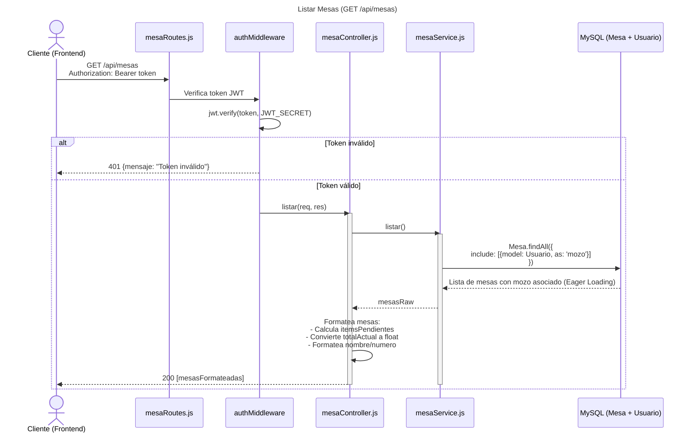
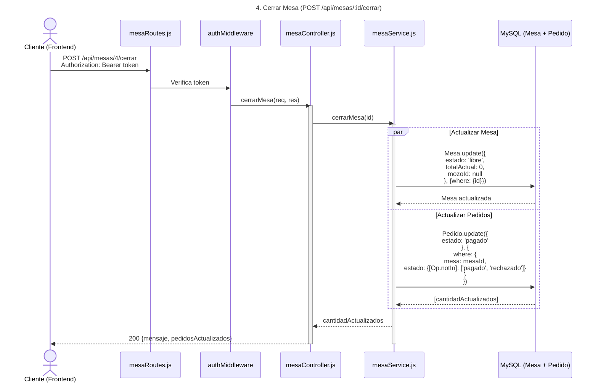
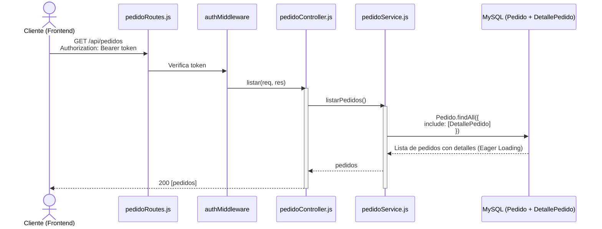
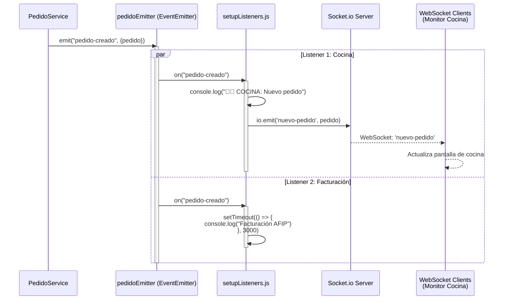
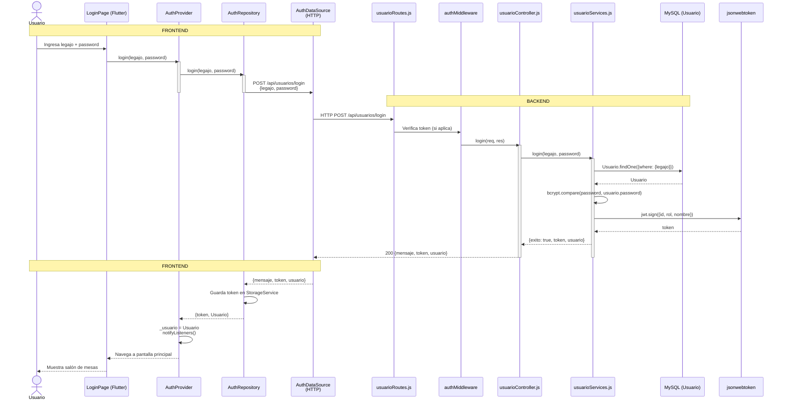
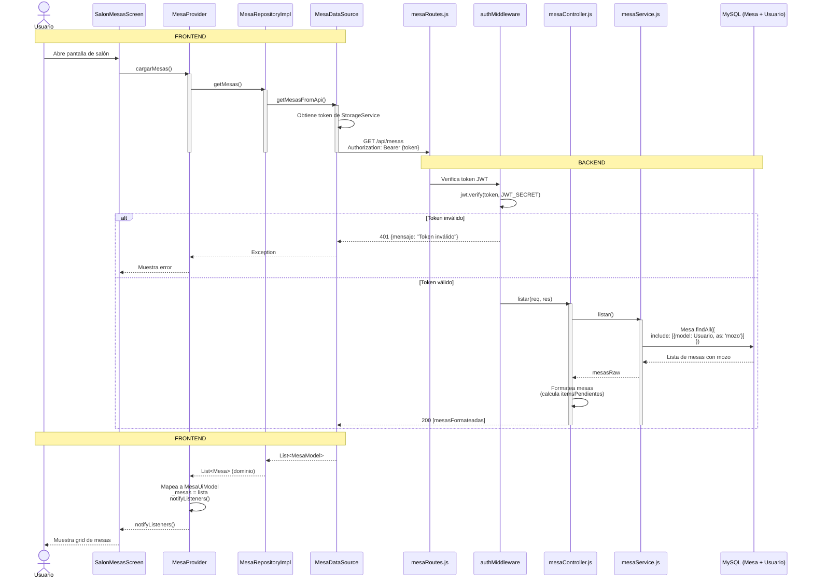
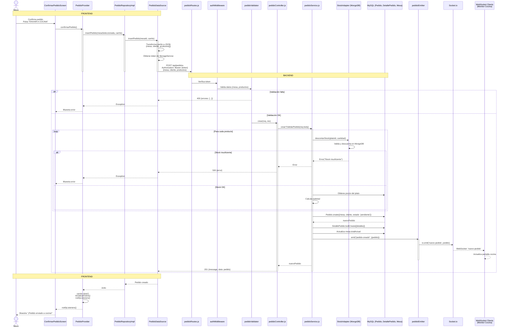
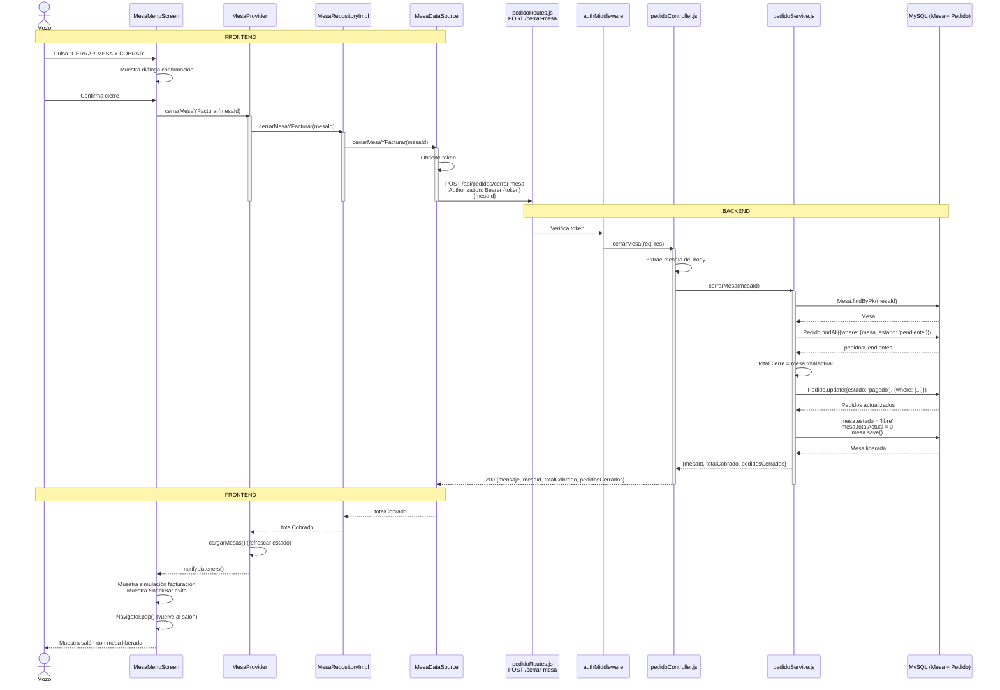

# 📊 Diagramas de Flujo - Casos de Uso del Backend

## 🏗️ Arquitectura del Backend

### Estructura de Capas

```
┌─────────────────────────────────────────────────────────────┐
│                    CAPA DE RUTAS (Routes)                     │
│  - Define endpoints HTTP                                      │
│  - Aplica middlewares (auth, validación)                      │
│  - Delega a Controllers                                       │
└───────────────────────┬───────────────────────────────────────┘
                        │ llama métodos
                        ▼
┌─────────────────────────────────────────────────────────────┐
│                  CAPA DE CONTROLADORES (Controllers)          │
│  - Recibe requests HTTP                                       │
│  - Valida datos de entrada                                    │
│  - Delega lógica de negocio a Services                       │
│  - Formatea respuestas HTTP                                   │
└───────────────────────┬───────────────────────────────────────┘
                        │ llama métodos
                        ▼
┌─────────────────────────────────────────────────────────────┐
│                    CAPA DE SERVICIOS (Services)               │
│  - Lógica de negocio                                          │
│  - Coordina múltiples modelos                                 │
│  - Emite eventos                                              │
│  - Maneja transacciones                                       │
└───────────────────────┬───────────────────────────────────────┘
                        │ usa modelos
                        ▼
┌─────────────────────────────────────────────────────────────┐
│                    CAPA DE MODELOS (Models)                   │
│  - Sequelize (MySQL) - Datos principales                     │
│  - Mongoose (MongoDB) - Stock                                │
│  - Acceso a base de datos                                    │
└─────────────────────────────────────────────────────────────┘
```

### Tecnologías Utilizadas

- **Express.js**: Framework web
- **Sequelize**: ORM para MySQL (mesas, pedidos, usuarios, platos)
- **Mongoose**: ODM para MongoDB (stock)
- **Socket.io**: WebSockets para tiempo real
- **JWT**: Autenticación con tokens
- **bcryptjs**: Encriptación de contraseñas
- **EventEmitter**: Sistema de eventos interno

---

## 🔐 CASOS DE USO DE AUTENTICACIÓN

### 1. Login (Iniciar Sesión)

```mermaid
sequenceDiagram
    actor C as Cliente (Frontend)
    participant UR as usuarioRoutes.js
    participant UC as usuarioController.js
    participant US as usuarioServices.js
    participant DB as MySQL (Usuario)
    participant JWT as jsonwebtoken
    title 1. Login (Iniciar Sesión)

    C ->> UR: POST /api/usuarios/login<br/>{legajo, password}
    UR ->> UC: login(req, res)
    activate UC
    UC ->> UC: Extrae legajo y password del body
    UC ->> US: login(legajo, password)
    activate US
    
    US ->> DB: Usuario.findOne({where: {legajo}})
    DB -->> US: Usuario encontrado o null
    
    alt Usuario no encontrado
        US -->> UC: {exito: false, mensaje: "Usuario no encontrado", status: 404}
        UC -->> C: 404 {mensaje}
        deactivate US
        deactivate UC
    else Usuario encontrado
        US ->> US: bcrypt.compare(passwordPlano, usuario.password)
        
        alt Contraseña incorrecta
            US -->> UC: {exito: false, mensaje: "Contraseña incorrecta", status: 401}
            UC -->> C: 401 {mensaje}
            deactivate US
            deactivate UC
        else Contraseña correcta
            US ->> JWT: jwt.sign({id, rol, nombre}, JWT_SECRET, {expiresIn: '24h'})
            JWT -->> US: token (JWT string)
            
            US -->> UC: {exito: true, token, usuario: {id, nombre, apellido, rol}}
            UC -->> C: 200 {mensaje: "Login exitoso", token, usuario}
            deactivate US
            deactivate UC
        end
    end
```

**Flujo:**
1. Cliente envía legajo y password
2. Controller extrae datos y delega al Service
3. Service busca usuario en BD por legajo
4. Si existe, compara password con bcrypt
5. Si es válido, genera token JWT
6. Retorna token y datos del usuario

**Notas:**
- La contraseña se compara con `bcrypt.compare` (nunca se desencripta)
- El token contiene: `id`, `rol`, `nombre`
- El token expira en 24 horas

---

## 🍽️ CASOS DE USO DE MESAS

### 2. Listar Mesas (GET /api/mesas)



**Flujo:**
1. Cliente envía request con token
2. Middleware valida token
3. Controller delega al Service
4. Service hace query con `include` (Eager Loading) para traer mozo
5. Controller formatea datos (calcula itemsPendientes, convierte tipos)
6. Retorna lista formateada

**Notas:**
- Usa **Eager Loading** para traer mozo en una sola query
- Calcula `itemsPendientes` basado en `totalActual > 0` o `estado === 'ocupada'`

---

### 3. Abrir Mesa (POST /api/mesas/:id/abrir)

```mermaid
sequenceDiagram
    actor C as Cliente (Frontend)
    participant MR as mesaRoutes.js
    participant AM as authMiddleware
    participant MC as mesaController.js
    participant MS as mesaService.js
    participant DB as MySQL (Mesa)
    title 3. Abrir Mesa (POST /api/mesas/:id/abrir)

    C ->> MR: POST /api/mesas/4/abrir<br/>{idMozo: 5}<br/>Authorization: Bearer token
    MR ->> AM: Verifica token
    AM ->> MC: abrirMesa(req, res)
    activate MC
    
    MC ->> MC: Extrae id (params) e idMozo (body)
    MC ->> MC: Valida que idMozo exista
    
    alt idMozo faltante
        MC -->> C: 400 {message: "Se requiere idMozo"}
        deactivate MC
    else Datos válidos
        MC ->> MS: abrirMesa(id, idMozo)
        activate MS
        
        MS ->> DB: Mesa.findByPk(idMesa)
        DB -->> MS: Mesa encontrada o null
        
        alt Mesa no encontrada
            MS -->> MC: Error("Mesa no encontrada")
            MC -->> C: 500 {message}
            deactivate MS
            deactivate MC
        else Mesa ya ocupada
            MS -->> MC: Error("La mesa ya está ocupada")
            MC -->> C: 500 {message}
            deactivate MS
            deactivate MC
        else Mesa libre
            MS ->> DB: mesa.estado = 'ocupada'<br/>mesa.mozoId = idMozo<br/>mesa.save()
            DB -->> MS: Mesa actualizada
            MS -->> MC: mesaActualizada
            MC -->> C: 200 {message: "Mesa abierta con éxito", mesa}
            deactivate MS
            deactivate MC
        end
    end
```

**Flujo:**
1. Cliente envía ID de mesa e ID de mozo
2. Controller valida datos
3. Service busca mesa por ID
4. Valida que esté libre
5. Actualiza estado a 'ocupada' y asigna mozoId
6. Retorna mesa actualizada

---

### 4. Cerrar Mesa (POST /api/mesas/:id/cerrar)



**Flujo:**
1. Cliente solicita cerrar mesa
2. Service ejecuta dos operaciones en paralelo:
   - Libera la mesa (estado='libre', totalActual=0, mozoId=null)
   - Marca todos los pedidos pendientes como 'pagado'
3. Retorna cantidad de pedidos actualizados

**Notas:**
- Usa operación atómica `update` para cambiar múltiples pedidos
- Filtra pedidos que NO estén ya pagados o rechazados

---

## 🧾 CASOS DE USO DE PEDIDOS

### 5. Crear Pedido (POST /api/pedidos)

```mermaid
sequenceDiagram
    title 5. Crear Pedido (POST /api/pedidos)
    actor C as Cliente (Frontend)
    participant PR as pedidoRoutes.js
    participant AM as authMiddleware
    participant PV as pedidoValidator
    participant PC as pedidoController.js
    participant PS as pedidoService.js
    participant SA as StockAdapter (MongoDB)
    participant DB as MySQL (Plato, Pedido, DetallePedido, Mesa)
    participant PE as pedidoEmitter (EventEmitter)
    participant IO as Socket.io

    C ->> PR: POST /api/pedidos<br/>{mesa, cliente, productos[]}<br/>Authorization: Bearer token
    PR ->> AM: Verifica token
    AM ->> PV: Valida datos (mesa, productos)
    
    alt Validación falla
        PV -->> C: 400 {errores: [...]}
    else Validación OK
        PV ->> PC: crear(req, res)
        activate PC
        PC ->> PS: crearYValidarPedido(req.body)
        activate PS
        
        loop Para cada producto en productos[]
            PS ->> SA: descontarStock(platoId, cantidad)
            activate SA
            SA ->> SA: Busca en MongoDB<br/>Valida stock disponible<br/>Descuenta cantidad
            
            alt Stock insuficiente
                SA -->> PS: Error("Stock insuficiente")
                deactivate SA
                PS -->> PC: Error
                PC -->> C: 500 {error}
                deactivate PS
                deactivate PC
            else Stock OK
                SA -->> PS: éxito
                deactivate SA
                PS ->> DB: Plato.findByPk(platoId)
                DB -->> PS: Plato con precio
                PS ->> PS: Calcula subtotal = precio * cantidad<br/>totalCalculado += subtotal<br/>Prepara detalle
            end
        end
        
        Note over PS,DB: Si llegamos aquí, todos los productos<br/>tienen stock válido
        
        PS ->> DB: Pedido.create({<br/>  mesa, cliente, estado: 'pendiente', total<br/>})
        DB -->> PS: nuevoPedido
        
        PS ->> DB: DetallePedido.bulkCreate([detalles])
        DB -->> PS: Detalles creados
        
        PS ->> PS: _actualizarMesa(mesaNumero, totalCalculado)
        PS ->> DB: Mesa.findByPk(mesaId)<br/>mesa.totalActual += total<br/>mesa.save()
        DB -->> PS: Mesa actualizada
        
        PS ->> PE: emit("pedido-creado", {pedido})
        activate PE
        PE ->> IO: io.emit('nuevo-pedido', pedido)
        IO -->> IO: Notifica a clientes WebSocket<br/>(Monitor de Cocina)
        deactivate PE
        
        PS -->> PC: nuevoPedido
        PC -->> C: 201 {message: "Pedido creado con éxito", data: pedido}
        deactivate PS
        deactivate PC
    end
```

**Flujo:**
1. Cliente envía pedido con productos
2. Middleware valida datos
3. Para cada producto:
   - Valida y descuenta stock en MongoDB
   - Obtiene precio del plato en MySQL
   - Calcula subtotal
4. Crea Pedido (cabecera) en MySQL
5. Crea DetallePedido (renglones) con bulkCreate
6. Actualiza totalActual de la Mesa
7. Emite evento "pedido-creado"
8. Socket.io notifica a clientes conectados (Monitor de Cocina)

**Notas:**
- Usa **transacciones implícitas** (si falla stock, no se crea pedido)
- **BulkCreate** optimiza la inserción de múltiples detalles
- **EventEmitter** desacopla la notificación (cocina, facturación)
- **Socket.io** notifica en tiempo real a pantallas de cocina

---

### 6. Listar Pedidos (GET /api/pedidos)



**Flujo:**
1. Cliente solicita lista de pedidos
2. Service hace query con Eager Loading (incluye DetallePedido)
3. Retorna lista completa

**Notas:**
- Usa **Eager Loading** para traer detalles en una sola query
- Estructura jerárquica: Pedido → DetallePedido[]

---

### 7. Buscar Pedidos por Mesa (GET /api/pedidos/mesa/:mesa)

```mermaid
sequenceDiagram
    actor C as Cliente (Frontend)
    participant PR as pedidoRoutes.js
    participant AM as authMiddleware
    participant PC as pedidoController.js
    participant PS as pedidoService.js
    participant DB as MySQL (Pedido + DetallePedido)

    C ->> PR: GET /api/pedidos/mesa/4<br/>Authorization: Bearer token
    PR ->> AM: Verifica token
    AM ->> PC: buscarPorMesa(req, res)
    activate PC
    
    PC ->> PC: Extrae mesa de params
    PC ->> PC: Valida que mesa exista
    
    alt Mesa faltante
        PC -->> C: 400 {error: "Número de mesa es obligatorio"}
        deactivate PC
    else Mesa válida
        PC ->> PS: buscarPedidosPorMesa(mesa)
        activate PS
        
        PS ->> DB: Pedido.findAll({<br/>  where: {mesa: mesaNumero},<br/>  include: [DetallePedido]<br/>})
        DB -->> PS: Lista de pedidos de esa mesa
        PS -->> PC: pedidos
        
        PC -->> C: 200 [pedidos]
        deactivate PS
        deactivate PC
    end
```

**Flujo:**
1. Cliente solicita pedidos de una mesa específica
2. Controller valida parámetro
3. Service filtra por mesa con Eager Loading
4. Retorna lista filtrada

---

### 8. Cerrar Mesa y Facturar (POST /api/pedidos/cerrar-mesa)

```mermaid
sequenceDiagram
    actor C as Cliente (Frontend)
    participant PR as pedidoRoutes.js
    participant AM as authMiddleware
    participant PC as pedidoController.js
    participant PS as pedidoService.js
    participant DB as MySQL (Mesa + Pedido)

    C ->> PR: POST /api/pedidos/cerrar-mesa<br/>{mesaId: 4}<br/>Authorization: Bearer token
    PR ->> AM: Verifica token
    AM ->> PC: cerrarMesa(req, res)
    activate PC
    
    PC ->> PC: Extrae mesaId del body
    PC ->> PC: Valida que mesaId exista
    
    alt mesaId faltante
        PC -->> C: 400 {error: "Falta el ID de la mesa"}
        deactivate PC
    else mesaId válido
        PC ->> PS: cerrarMesa(mesaId)
        activate PS
        
        PS ->> DB: Mesa.findByPk(mesaId)
        DB -->> PS: Mesa encontrada o null
        
        alt Mesa no encontrada
            PS -->> PC: Error("Mesa no encontrada")
            PC -->> C: 500 {error}
            deactivate PS
            deactivate PC
        else Mesa encontrada
            PS ->> DB: Pedido.findAll({<br/>  where: {mesa: mesaId, estado: 'pendiente'}<br/>})
            DB -->> PS: pedidosPendientes
            
            PS ->> PS: totalCierre = mesa.totalActual
            
            PS ->> DB: Pedido.update({<br/>  estado: 'pagado'<br/>}, {<br/>  where: {<br/>    mesa: mesaId,<br/>    estado: {[Op.or]: [<br/>      'pendiente',<br/>      'en_preparacion',<br/>      'entregado'<br/>    ]}<br/>  }<br/>})
            DB -->> PS: Pedidos actualizados
            
            PS ->> DB: mesa.estado = 'libre'<br/>mesa.totalActual = 0<br/>mesa.mozoAsignado = null<br/>mesa.save()
            DB -->> PS: Mesa liberada
            
            PS -->> PC: {mesaId, totalCobrado, pedidosCerrados}
            PC -->> C: 200 {mensaje, mesaId, totalCobrado, pedidosCerrados}
            deactivate PS
            deactivate PC
        end
    end
```

**Flujo:**
1. Cliente solicita cerrar mesa
2. Service busca mesa y pedidos pendientes
3. Calcula total a cobrar (mesa.totalActual)
4. Actualiza todos los pedidos a estado 'pagado'
5. Libera la mesa (estado='libre', totalActual=0)
6. Retorna total cobrado y cantidad de pedidos cerrados

**Notas:**
- Actualiza pedidos en estados: pendiente, en_preparacion, entregado
- Guarda el total antes de liberar la mesa
- Este endpoint es diferente de `/api/mesas/:id/cerrar` (más completo)

---

### 9. Eliminar Pedido (DELETE /api/pedidos/:id)

```mermaid
sequenceDiagram
    actor C as Cliente (Frontend)
    participant PR as pedidoRoutes.js
    participant AM as authMiddleware
    participant PC as pedidoController.js
    participant PS as pedidoService.js
    participant DB as MySQL (Pedido + Mesa)
    participant SA as StockAdapter (MongoDB)

    C ->> PR: DELETE /api/pedidos/123<br/>Authorization: Bearer token
    PR ->> AM: Verifica token
    AM ->> PC: eliminar(req, res)
    activate PC
    
    PC ->> PC: Extrae id de params
    PC ->> PS: eliminarPedido(id)
    activate PS
    
    PS ->> DB: Pedido.findByPk(id)
    DB -->> PS: Pedido encontrado o null
    
    alt Pedido no encontrado
        PS -->> PC: Error("PEDIDO_NO_ENCONTRADO")
        PC -->> C: 404 {error: "El pedido no existe"}
        deactivate PS
        deactivate PC
    else Pedido encontrado
        PS ->> PS: _actualizarMesa(pedido.mesa, -pedido.total)
        PS ->> DB: Mesa.findByPk(mesaId)<br/>mesa.totalActual -= pedido.total<br/>mesa.save()
        DB -->> PS: Mesa actualizada
        
        Note over PS,SA: Restaurar stock (si fuera necesario)
        PS ->> DB: pedido.destroy()
        DB -->> PS: Pedido eliminado
        
        PS -->> PC: éxito
        PC -->> C: 200 {mensaje: "Pedido eliminado y stock restaurado"}
        deactivate PS
        deactivate PC
    end
```

**Flujo:**
1. Cliente solicita eliminar pedido
2. Service busca pedido por ID
3. Actualiza mesa (resta el total del pedido)
4. Elimina pedido (cascada elimina DetallePedido)
5. Retorna éxito

**Notas:**
- Resta el total del pedido del `totalActual` de la mesa
- La eliminación es en cascada (DetallePedido se elimina automáticamente)
- El stock NO se restaura automáticamente (debería implementarse)

---

## 🔄 SISTEMA DE EVENTOS Y WEBSOCKETS

### 10. Flujo de Eventos: Pedido Creado → Notificación Cocina



**Flujo:**
1. PedidoService emite evento "pedido-creado"
2. setupListeners tiene dos listeners registrados:
   - **Cocina**: Notifica por Socket.io inmediatamente
   - **Facturación**: Simula proceso lento (3 segundos)
3. Socket.io emite a todos los clientes conectados
4. Monitor de Cocina recibe y actualiza pantalla

**Notas:**
- Usa **EventEmitter** de Node.js para desacoplar
- **Socket.io** permite notificaciones en tiempo real
- Múltiples listeners pueden escuchar el mismo evento

---

## 📊 RESUMEN: Flujo de Información en el Backend

```
┌─────────────────────────────────────────────────────────────┐
│                    CLIENTE (Frontend)                         │
│  - Envía HTTP requests                                        │
│  - Incluye token JWT en headers                              │
└───────────────────────┬───────────────────────────────────────┘
                        │ HTTP Request
                        ▼
┌─────────────────────────────────────────────────────────────┐
│                    ROUTES (Express Router)                    │
│  - Define endpoints                                           │
│  - Aplica middlewares (auth, validación)                     │
└───────────────────────┬───────────────────────────────────────┘
                        │ delega a
                        ▼
┌─────────────────────────────────────────────────────────────┐
│                    CONTROLLERS                                │
│  - Extrae datos de req                                       │
│  - Valida entrada                                            │
│  - Formatea salida                                           │
└───────────────────────┬───────────────────────────────────────┘
                        │ delega lógica de negocio
                        ▼
┌─────────────────────────────────────────────────────────────┐
│                    SERVICES                                   │
│  - Lógica de negocio                                          │
│  - Coordina múltiples modelos                                 │
│  - Emite eventos                                             │
└───────────────────────┬───────────────────────────────────────┘
                        │ usa modelos
                        ▼
┌─────────────────────────────────────────────────────────────┐
│                    MODELS (Sequelize/Mongoose)                │
│  - Sequelize: MySQL (mesas, pedidos, usuarios, platos)       │
│  - Mongoose: MongoDB (stock)                                  │
└─────────────────────────────────────────────────────────────┘

┌─────────────────────────────────────────────────────────────┐
│                    EVENT SYSTEM                               │
│  - EventEmitter: Eventos internos                            │
│  - Socket.io: Notificaciones en tiempo real                  │
└─────────────────────────────────────────────────────────────┘
```

**Reglas de Arquitectura:**
- ✅ **Routes** solo definen endpoints y middlewares
- ✅ **Controllers** solo extraen datos y formatean respuestas
- ✅ **Services** contienen toda la lógica de negocio
- ✅ **Models** solo acceden a base de datos
- ✅ **EventEmitter** desacopla notificaciones
- ✅ **Socket.io** notifica en tiempo real

**NUNCA:**
- ❌ Lógica de negocio en Controllers
- ❌ Lógica de negocio en Routes
- ❌ Acceso directo a BD desde Controllers
- ❌ Validaciones complejas en Routes (usar middlewares)

---

## 🎓 Conceptos Clave para Tu Tesis

### 1. **Inyección de Dependencias**
```javascript
// En mesaRoutes.js
const mesaService = new MesaService();
const mesaController = new MesaController(mesaService);
```
- Facilita testing (puedes pasar mocks)
- Desacopla componentes

### 2. **Eager Loading (Sequelize)**
```javascript
Mesa.findAll({
  include: [{model: Usuario, as: 'mozo'}]
})
```
- Trae datos relacionados en una sola query
- Evita N+1 queries problem

### 3. **Bulk Operations**
```javascript
DetallePedido.bulkCreate(detalles)
```
- Optimiza inserción de múltiples registros
- Más eficiente que múltiples `create()`

### 4. **Event-Driven Architecture**
```javascript
pedidoEmitter.emit("pedido-creado", {pedido})
```
- Desacopla componentes
- Permite múltiples listeners
- Facilita escalabilidad

### 5. **WebSockets (Socket.io)**
```javascript
io.emit('nuevo-pedido', pedido)
```
- Comunicación en tiempo real
- Notificaciones push
- Ideal para monitores de cocina

---

---

## 🔄 COMPARACIÓN FRONTEND ↔ BACKEND: Cómo Se Comunican

### Visión General de la Comunicación

```
┌─────────────────────────────────────────────────────────────┐
│                    FRONTEND (Flutter/Dart)                    │
│  ┌──────────────┐  ┌──────────────┐  ┌──────────────┐      │
│  │   Pantallas  │  │   Providers  │  │  DataSource  │      │
│  │   (UI)       │  │   (Estado)   │  │   (HTTP)     │      │
│  └──────┬───────┘  └──────┬───────┘  └──────┬───────┘      │
└─────────┼──────────────────┼──────────────────┼────────────┘
          │                  │                  │
          │  llama métodos   │  llama métodos   │
          └──────────────────┴──────────────────┘
                              │
                              │ HTTP Request
                              │ Authorization: Bearer token
                              │ Content-Type: application/json
                              ▼
┌─────────────────────────────────────────────────────────────┐
│                    BACKEND (Node.js/Express)                  │
│  ┌──────────────┐  ┌──────────────┐  ┌──────────────┐      │
│  │    Routes    │  │ Controllers  │  │   Services   │      │
│  │  (Endpoints) │  │  (Lógica)    │  │  (Negocio)   │      │
│  └──────┬───────┘  └──────┬───────┘  └──────┬───────┘      │
└─────────┼──────────────────┼──────────────────┼────────────┘
          │                  │                  │
          │  delega a        │  delega a        │  usa modelos
          └──────────────────┴──────────────────┘
                              │
                              │ SQL / MongoDB
                              ▼
                    ┌──────────────────┐
                    │   BASE DE DATOS   │
                    │  MySQL + MongoDB  │
                    └──────────────────┘
```

---

### Ejemplo 1: Login Completo (Frontend → Backend)



**Flujo Completo:**
1. **Frontend**: Usuario ingresa credenciales → AuthProvider → AuthRepository → DataSource
2. **HTTP**: DataSource hace POST a `/api/usuarios/login`
3. **Backend**: Route → Middleware → Controller → Service → Model → BD
4. **Backend**: Service genera token JWT y retorna usuario
5. **HTTP**: Backend responde 200 con token y usuario
6. **Frontend**: DataSource recibe respuesta → Repository guarda token → Provider actualiza estado → UI navega

**Puntos Clave:**
- ✅ Frontend NO conoce detalles de HTTP (DataSource lo abstrae)
- ✅ Backend valida y genera token
- ✅ Token se guarda en almacenamiento seguro del frontend
- ✅ Frontend usa token en headers de todas las requests siguientes

---

### Ejemplo 2: Cargar Mesas (Frontend → Backend)



**Flujo Completo:**
1. **Frontend**: UI llama Provider → Repository → DataSource
2. **HTTP**: DataSource obtiene token y hace GET con header `Authorization: Bearer {token}`
3. **Backend**: Middleware valida token → Controller → Service → BD con Eager Loading
4. **Backend**: Service retorna mesas con mozo asociado
5. **HTTP**: Backend responde 200 con array de mesas
6. **Frontend**: DataSource parsea JSON → Repository mapea a dominio → Provider mapea a UI → UI se actualiza

**Puntos Clave:**
- ✅ Token se envía en **cada request** en el header `Authorization`
- ✅ Backend valida token en **cada request** con middleware
- ✅ Frontend mapea datos en múltiples capas (DataSource → Repository → Provider → UI)
- ✅ Backend usa Eager Loading para optimizar queries

---

### Ejemplo 3: Crear Pedido (Frontend → Backend → Eventos)



**Flujo Completo:**
1. **Frontend**: Usuario confirma → Provider transforma carrito a JSON → DataSource envía POST
2. **HTTP**: POST `/api/pedidos` con token y datos del pedido
3. **Backend**: Middleware valida token → Validator valida datos → Controller → Service
4. **Backend**: Service valida stock (MongoDB) → Crea pedido (MySQL) → Actualiza mesa → Emite evento
5. **Eventos**: EventEmitter → Socket.io → Notifica a clientes WebSocket (Monitor Cocina)
6. **HTTP**: Backend responde 201 con pedido creado
7. **Frontend**: DataSource recibe respuesta → Provider limpia carrito → Recarga datos → UI muestra éxito

**Puntos Clave:**
- ✅ Frontend transforma objetos Dart a JSON antes de enviar
- ✅ Backend valida stock en MongoDB (diferente BD)
- ✅ Backend emite eventos que notifican a otros sistemas (cocina)
- ✅ Frontend limpia carrito y recarga datos después del éxito

---

### Ejemplo 4: Cerrar Mesa y Facturar (Frontend → Backend)



**Flujo Completo:**
1. **Frontend**: Usuario confirma cierre → Provider llama método
2. **HTTP**: POST `/api/pedidos/cerrar-mesa` con mesaId
3. **Backend**: Valida token → Controller → Service busca mesa y pedidos
4. **Backend**: Service calcula total → Actualiza pedidos a 'pagado' → Libera mesa
5. **HTTP**: Backend responde 200 con totalCobrado
6. **Frontend**: Provider recibe totalCobrado → Refresca mesas → Muestra simulación → Vuelve al salón

**Puntos Clave:**
- ✅ Frontend muestra simulación de facturación (UI)
- ✅ Backend calcula total y actualiza múltiples entidades
- ✅ Frontend refresca estado después del cierre
- ✅ Navegación vuelve al salón automáticamente

---

## 📋 Tabla Comparativa: Frontend vs Backend

| Aspecto | Frontend (Flutter) | Backend (Node.js) |
|---------|-------------------|-------------------|
| **Arquitectura** | Clean Architecture<br/>(UI → Provider → Repository → DataSource) | MVC/Service Layer<br/>(Routes → Controllers → Services → Models) |
| **Responsabilidad** | Presentación y gestión de estado | Lógica de negocio y persistencia |
| **Autenticación** | Guarda token en StorageService<br/>Envía en headers | Valida token con JWT<br/>Middleware en cada request |
| **Validación** | Validación de UI (opcional) | Validación de datos (obligatoria) |
| **Manejo de Errores** | Muestra mensajes al usuario | Retorna códigos HTTP<br/>Mensajes estructurados |
| **Transformación de Datos** | Mapea JSON → Objetos Dart<br/>Múltiples capas de mapeo | Recibe JSON<br/>Transforma a modelos Sequelize |
| **Estado** | Provider mantiene estado local<br/>notifyListeners() | Stateless (cada request es independiente) |
| **Comunicación** | HTTP requests (DataSource) | HTTP responses (Controllers) |
| **Tiempo Real** | Escucha WebSockets (opcional) | Emite eventos WebSocket (Socket.io) |

---

## 🔑 Puntos Clave de la Comunicación

### 1. **Autenticación con JWT**

**Frontend:**
```dart
// En MesaDataSource
final token = await _storage.getToken();
headers: {
  "Authorization": "Bearer $token",
}
```

**Backend:**
```javascript
// En authMiddleware
const token = authHeader.startsWith('Bearer ') 
  ? authHeader.slice(7) 
  : authHeader;
const decoded = jwt.verify(token, JWT_SECRET);
req.usuario = decoded;
```

**Flujo:**
- Frontend guarda token después del login
- Frontend envía token en **cada request** en header `Authorization`
- Backend valida token en **cada request** con middleware
- Si token inválido → Backend responde 401 → Frontend redirige a login

---

### 2. **Transformación de Datos**

**Frontend (Dart → JSON):**
```dart
// En PedidoDataSource
body: jsonEncode({
  "mesa": mesaId,
  "cliente": "Mesa X",
  "productos": carrito.map((item) => {
    return {
      "platoId": item.platoId,
      "cantidad": item.cantidad,
      "aclaracion": item.aclaracion ?? "",
    };
  }).toList(),
})
```

**Backend (JSON → Sequelize):**
```javascript
// En PedidoService
const nuevoPedido = await Pedido.create({
  mesa: datosPedido.mesa,
  cliente: datosPedido.cliente,
  estado: 'pendiente',
  total: totalCalculado
});
```

**Flujo:**
- Frontend transforma objetos Dart a Map/JSON
- Backend recibe JSON y lo transforma a modelos Sequelize
- Backend retorna JSON
- Frontend parsea JSON y lo transforma a objetos Dart

---

### 3. **Manejo de Errores**

**Frontend:**
```dart
try {
  final response = await http.post(...);
  if (response.statusCode == 200) {
    // Éxito
  } else {
    // Error del servidor
    _error = 'Error: ${response.statusCode}';
  }
} catch (e) {
  // Error de conexión
  _error = 'Error de conexión: $e';
}
```

**Backend:**
```javascript
try {
  const pedido = await pedidoService.crear(...);
  res.status(201).json({ message: "Éxito", data: pedido });
} catch (error) {
  res.status(500).json({ error: error.message });
}
```

**Flujo:**
- Backend retorna códigos HTTP estándar (200, 400, 401, 404, 500)
- Frontend interpreta códigos y muestra mensajes apropiados
- Errores de red se capturan en el Frontend (try/catch)

---

### 4. **Sistema de Eventos (WebSockets)**

**Backend (Emisor):**
```javascript
// En PedidoService
pedidoEmitter.emit("pedido-creado", { pedido });

// En setupListeners
io.emit('nuevo-pedido', pedido);
```

**Frontend (Receptor - Futuro):**
```dart
// Ejemplo de cómo podría escuchar WebSockets
socket.on('nuevo-pedido', (data) {
  // Actualizar UI en tiempo real
});
```

**Flujo:**
- Backend emite eventos internos (EventEmitter)
- Backend notifica por WebSocket a clientes conectados
- Frontend puede escuchar WebSockets para actualizaciones en tiempo real
- Actualmente usado para Monitor de Cocina (HTML)

---

## 🎓 Conceptos Clave para Tu Tesis

### 1. **Separación de Responsabilidades**
- **Frontend**: Presentación, UX, gestión de estado local
- **Backend**: Lógica de negocio, validación, persistencia, seguridad

### 2. **Comunicación HTTP RESTful**
- Frontend hace requests HTTP (GET, POST, DELETE)
- Backend responde con códigos HTTP estándar
- Datos en formato JSON

### 3. **Autenticación Stateless**
- Token JWT se envía en cada request
- Backend valida token sin mantener sesión
- Frontend guarda token localmente

### 4. **Transformación de Datos en Capas**
- Frontend: JSON ↔ Objetos Dart (múltiples capas)
- Backend: JSON ↔ Modelos Sequelize (una capa)

### 5. **Manejo de Errores Consistente**
- Backend retorna códigos HTTP estándar
- Frontend interpreta códigos y muestra mensajes
- Errores de red se manejan en Frontend

---

## 📚 Próximos Pasos Sugeridos

1. **Revisar otros endpoints** (platos, rubros)
2. **Documentar sistema de stock** (MongoDB)
3. **Crear diagramas de base de datos** (ER)
4. **Documentar middlewares** (auth, validación)

---

**¡Éxito con tu proyecto de tesis!** 🚀

