# 📊 Diagramas de Flujo - Casos de Uso de Mesas

## 🔴 PROBLEMA DETECTADO: Inconsistencia Arquitectónica

### Flujo ACTUAL (INCORRECTO) - Refrescar Datos de Mesa

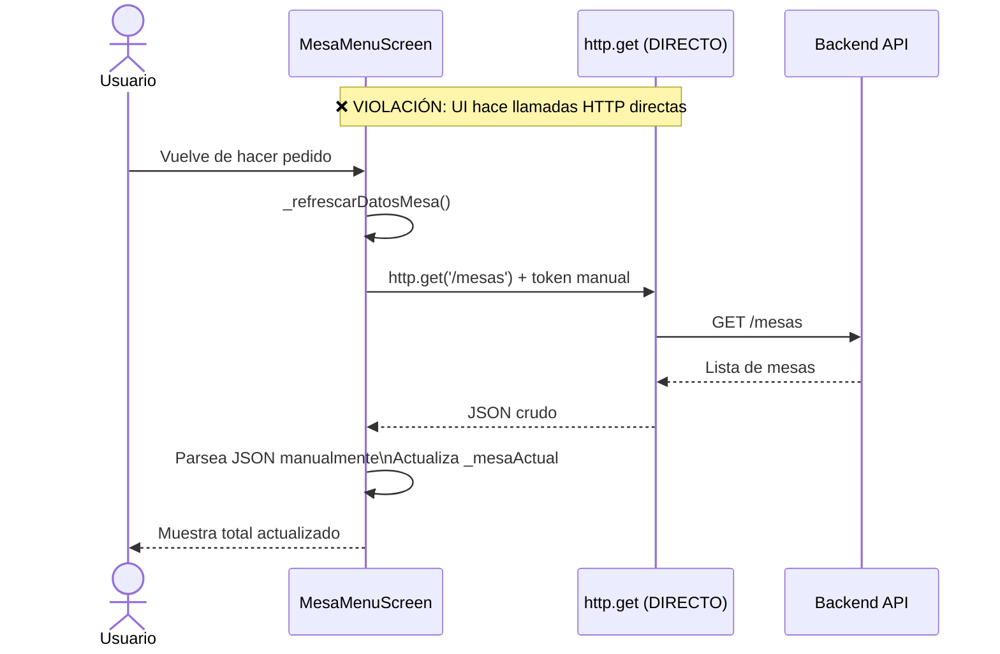

**Problemas:**
- ❌ La UI conoce detalles de HTTP (`http.get`, headers, tokens)
- ❌ Lógica de parsing en la UI
- ❌ No reutiliza el código del `MesaProvider` que ya existe
- ❌ Si cambia el endpoint, hay que modificar la UI

---

### Flujo CORRECTO según Clean Architecture - Refrescar Datos de Mesa

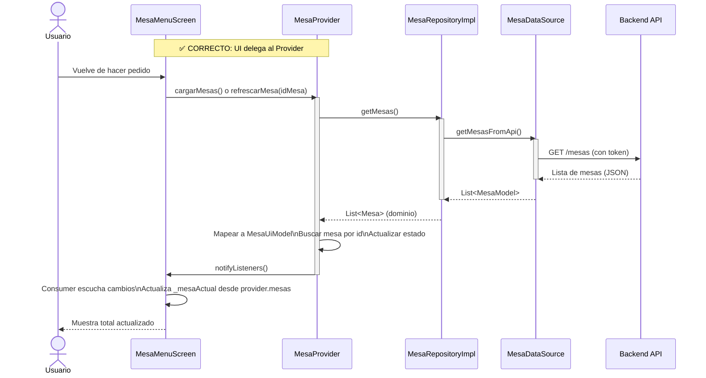

**Ventajas:**
- ✅ La UI solo conoce el Provider
- ✅ Reutiliza la lógica existente
- ✅ Fácil de testear (mock del Provider)
- ✅ Si cambia el endpoint, solo se modifica el DataSource

---

## 📋 CASOS DE USO CORREGIDOS

### 1. Caso de Uso: Cargar Mesas al Entrar al Salón

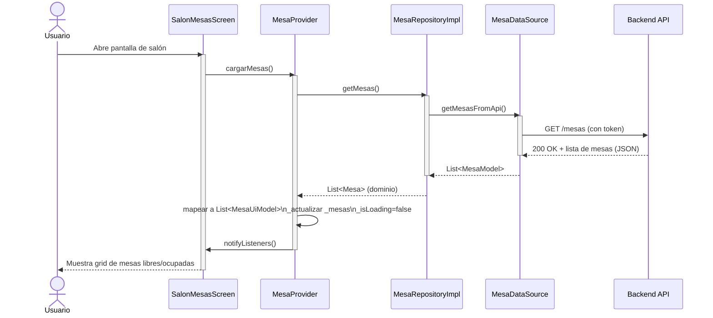

---

### 2. Caso de Uso: Abrir Mesa (Mesa Libre en Salón)

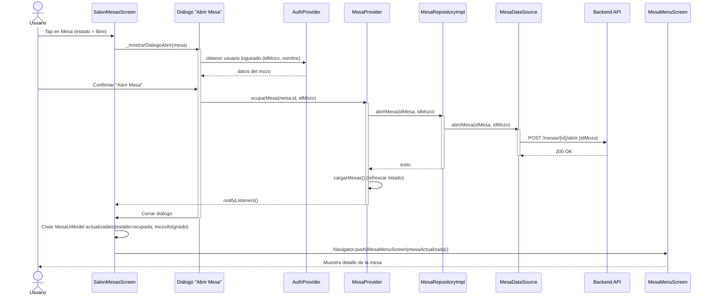

---

### 3. Caso de Uso: Hacer Pedido desde MesaMenuScreen (CORREGIDO)

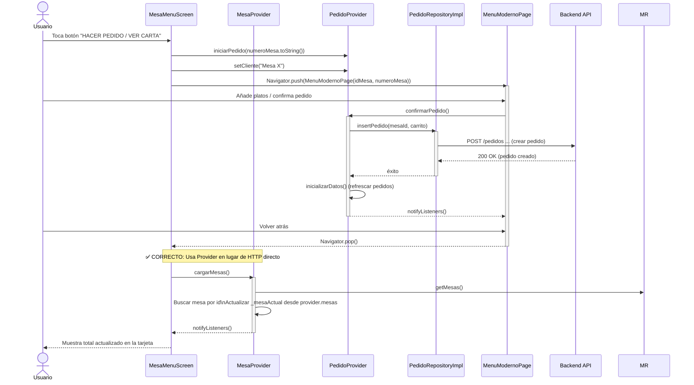

---

### 4. Caso de Uso: Ver Pedido en Curso de una Mesa

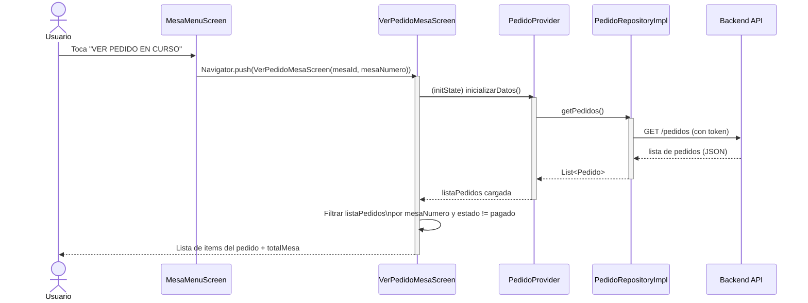

---

### 5. Caso de Uso: Cerrar Mesa y Cobrar (CORREGIDO)

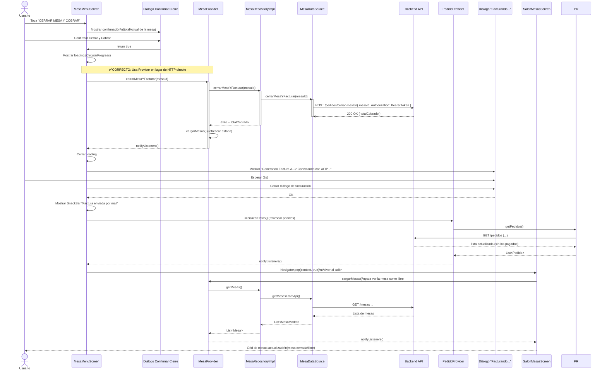

---

## 🔧 CAMBIOS NECESARIOS PARA CORREGIR LA ARQUITECTURA

### 1. Agregar método en `MesaRepository` (contrato)

```dart
abstract class MesaRepository {
  Future<List<Mesa>> getMesas();
  Future<void> abrirMesa(int idMesa, int idMozo);
  Future<void> cerrarMesa(int idMesa);
  // ✅ NUEVO: Para cerrar mesa y facturar
  Future<double> cerrarMesaYFacturar(int idMesa);
}
```

### 2. Implementar en `MesaDataSource`

```dart
Future<double> cerrarMesaYFacturar(int idMesa) async {
  final url = Uri.parse('$baseUrl/pedidos/cerrar-mesa');
  final response = await http.post(
    url,
    headers: await _getAuthHeaders(),
    body: jsonEncode({"mesaId": idMesa}),
  );
  
  if (response.statusCode == 200) {
    final data = jsonDecode(response.body);
    return double.parse(data['totalCobrado'].toString());
  } else {
    throw Exception('Error: ${response.statusCode}');
  }
}
```

### 3. Agregar método en `MesaProvider`

```dart
Future<double?> cerrarMesaYFacturar(int idMesa) async {
  try {
    final totalCobrado = await _repository.cerrarMesaYFacturar(idMesa);
    await cargarMesas(); // Refrescar estado de mesas
    return totalCobrado;
  } catch (_) {
    return null;
  }
}
```

### 4. Modificar `MesaMenuScreen` para usar el Provider

```dart
// ❌ ANTES (INCORRECTO):
Future<void> _refrescarDatosMesa() async {
  final response = await http.get(url, headers: {...});
  // parsing manual...
}

// ✅ DESPUÉS (CORRECTO):
Future<void> _refrescarDatosMesa() async {
  final mesaProvider = Provider.of<MesaProvider>(context, listen: false);
  await mesaProvider.cargarMesas();
  
  // Buscar nuestra mesa en la lista del provider
  final mesaActualizada = mesaProvider.mesas
      .firstWhere((m) => m.id == widget.mesa.id);
  
  setState(() {
    _mesaActual = mesaActualizada;
  });
}
```

---

## 🔐 CASOS DE USO DE AUTENTICACIÓN

### 1. Login (Iniciar Sesión)

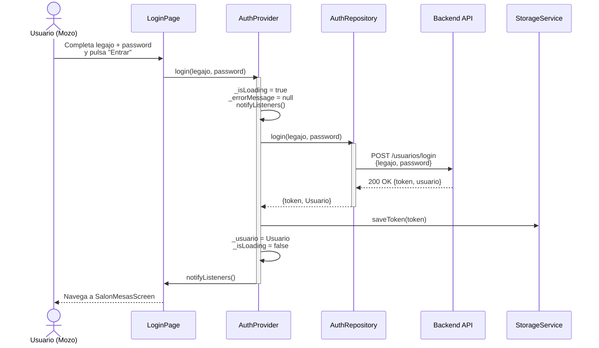

**Notas:**
- El token se guarda en almacenamiento seguro para mantener sesión
- El usuario queda en memoria para acceso rápido
- Si falla, se muestra mensaje de error en la UI

---

### 2. Logout (Cerrar Sesión)

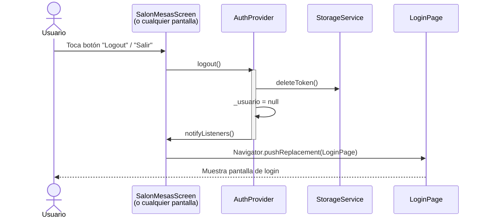

**Notas:**
- Elimina el token del almacenamiento seguro
- Limpia el usuario de la memoria
- Redirige a la pantalla de login

---

## 🧾 CASOS DE USO DE PEDIDOS

### 3. Inicializar Datos (Cargar Menú + Rubros + Pedidos)

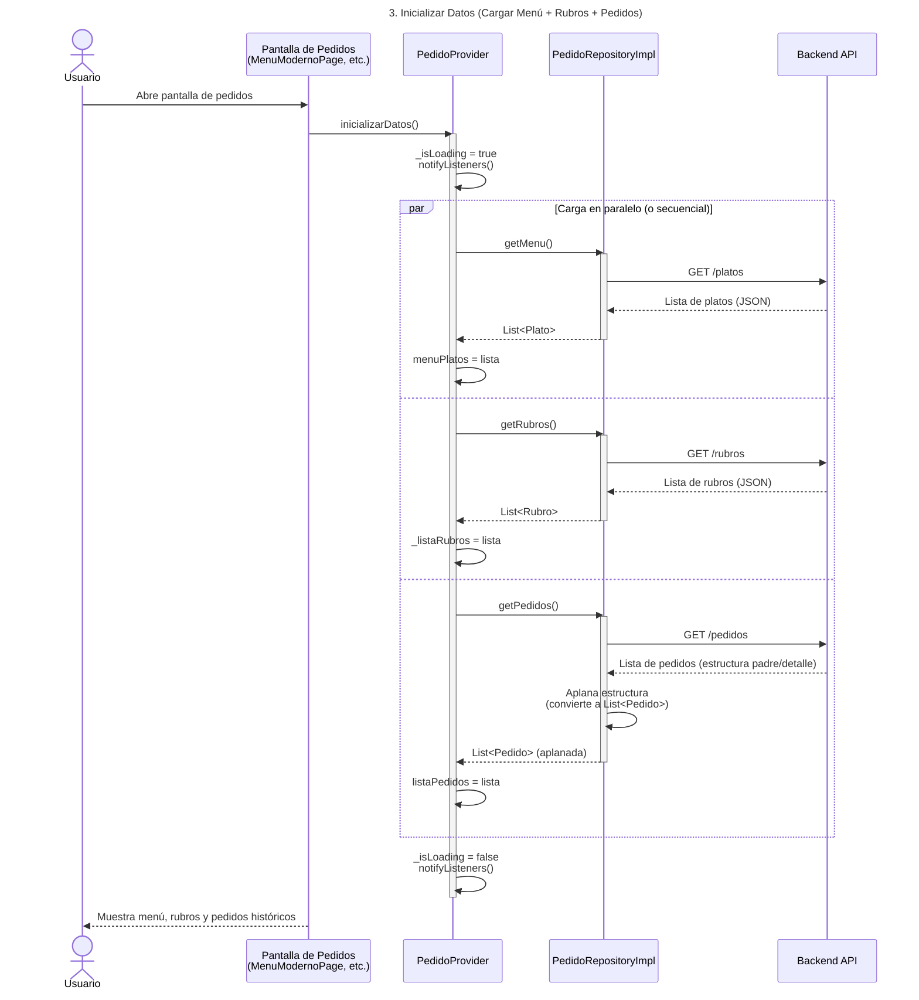

**Notas:**
- Carga 3 tipos de datos: menú, rubros y pedidos históricos
- El repositorio aplana la estructura jerárquica de pedidos del backend
- Si hay error, se muestra mensaje y se puede usar caché local (SQLite)

---

### 4. Agregar al Carrito (Lógica Local)

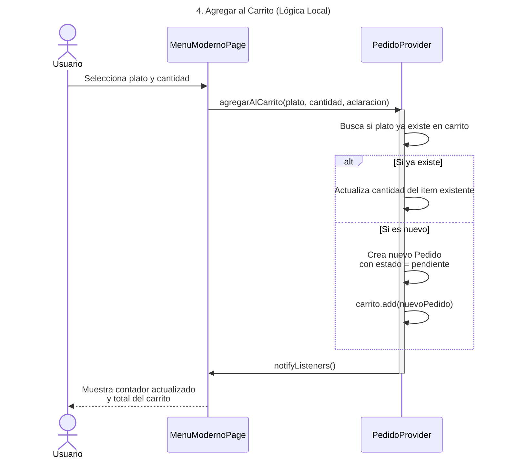

**Notas:**
- Es lógica local (no llama al backend aún)
- Si el plato ya está en el carrito, solo actualiza la cantidad
- El pedido se crea con estado `pendiente` por defecto

---

### 5. Confirmar Pedido / Enviar a Cocina

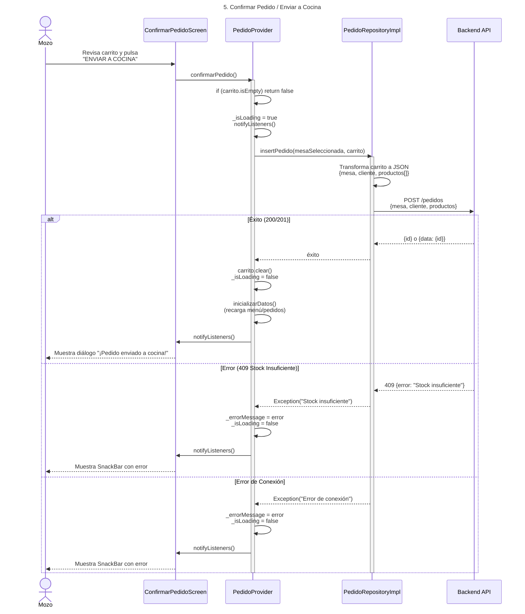

**Notas:**
- El pedido se crea con estado `pendiente` (automáticamente "enviado a cocina")
- Si hay stock insuficiente, el backend responde 409
- Después de confirmar, se vacía el carrito y se recargan los datos

---

### 6. Borrar Pedido Histórico (Eliminación Optimista)

```mermaid
sequenceDiagram
    actor U as Usuario
    participant HP as Pantalla Historial<br/>(o lista de pedidos)
    participant PP as PedidoProvider
    participant PR as PedidoRepositoryImpl
    participant API as Backend API
    title 6. Borrar Pedido Histórico (Eliminación Optimista)

    U ->> HP: Toca "Eliminar" en un pedido
    HP ->> PP: borrarPedidoHistorico(id)
    activate PP

    Note over PP: Eliminación Optimista:<br/>Primero UI, luego backend
    PP ->> PP: listaPedidos.removeWhere(p.id == id)<br/>notifyListeners()
    HP -->> U: Item desaparece inmediatamente (UX rápida)

    PP ->> PR: deletePedido(id)
    activate PR
    PR ->> API: DELETE /pedidos/{id}
    
    alt Éxito
        API -->> PR: 200 OK
        PR -->> PP: éxito
        deactivate PR
        deactivate PP
        HP -->> U: Lista actualizada (sin cambios visuales)
    else Error
        API -->> PR: Error (404, 500, etc.)
        PR -->> PP: Exception
        deactivate PR
        PP ->> PP: inicializarDatos()<br/>(rollback: recarga desde backend)
        PP ->> HP: notifyListeners()
        deactivate PP
        HP -->> U: Item vuelve a aparecer<br/>(se revierte el cambio)
    end
```

**Notas:**
- **Eliminación optimista**: primero se actualiza la UI, luego se llama al backend
- Si el backend falla, se hace rollback recargando los datos
- Esto hace que la app se sienta más rápida (UX mejorada)

---

## 📊 RESUMEN: Flujo de Información Correcto

```
┌─────────────────────────────────────────────────────────────┐
│                    CAPA DE PRESENTACIÓN                     │
│  ┌──────────────┐  ┌──────────────┐  ┌──────────────┐     │
│  │   Pantallas  │  │   Providers  │  │   Widgets    │     │
│  │   (UI)       │  │   (Estado)    │  │   (Visual)   │     │
│  └──────┬───────┘  └──────┬────────┘  └──────────────┘     │
└─────────┼──────────────────┼────────────────────────────────┘
          │                  │
          │  llama métodos   │
          └──────────────────┘
                    │
┌───────────────────▼──────────────────────────────────────────┐
│                    CAPA DE DOMINIO                           │
│  ┌──────────────────────────────────────────────────────┐   │
│  │         Repositories (Contratos/Interfaces)          │   │
│  │  - MesaRepository                                    │   │
│  │  - PedidoRepository                                  │   │
│  └───────────────────┬──────────────────────────────────┘   │
└──────────────────────┼───────────────────────────────────────┘
                       │
                       │  implementa
                       │
┌──────────────────────▼───────────────────────────────────────┐
│                    CAPA DE DATOS                             │
│  ┌──────────────────┐         ┌──────────────────┐          │
│  │ RepositoryImpl   │────────▶│   DataSource      │          │
│  │  (Implementación)│         │   (HTTP/API)     │          │
│  └──────────────────┘         └────────┬─────────┘          │
└─────────────────────────────────────────┼────────────────────┘
                                          │
                                          │  HTTP requests
                                          │
┌─────────────────────────────────────────▼──────────────────┐
│                    BACKEND API                               │
│              (Tu servidor Node.js/Express)                   │
└───────────────────────────────────────────────────────────────┘
```

**Regla de Oro:**
- ✅ **UI** solo conoce **Providers**
- ✅ **Providers** solo conocen **Repositories** (interfaces)
- ✅ **Repositories** solo conocen **DataSources**
- ✅ **DataSources** conocen HTTP/API

**NUNCA:**
- ❌ UI haciendo llamadas HTTP directas
- ❌ UI conociendo tokens, headers, URLs
- ❌ Lógica de parsing en la UI

